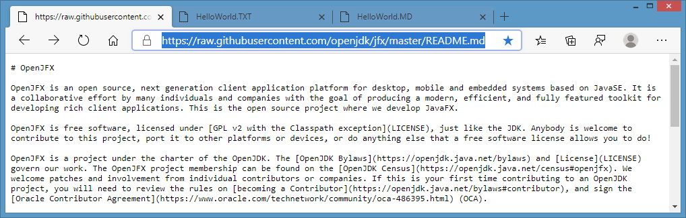
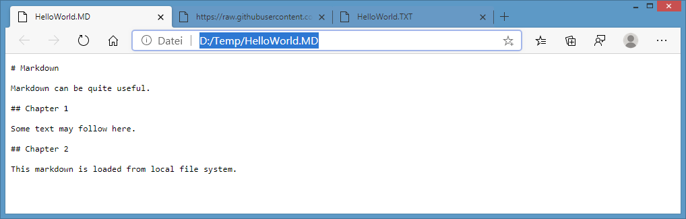
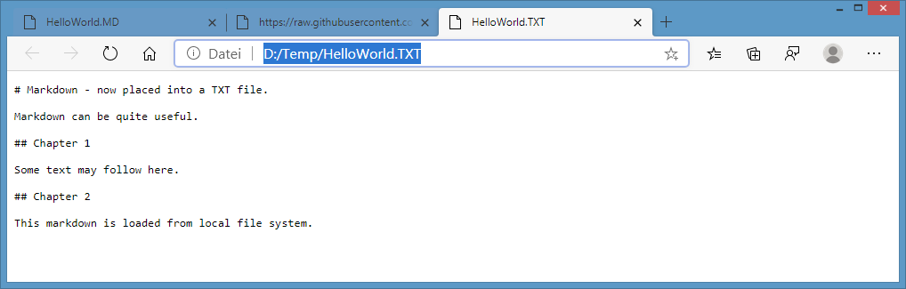

# JavaFX 16-ea+6 - possible bug in WebView

## Expected behavior

Chromium based web browsers render local and remote based MarkDown (MD) files as plain text, as shown in following images.

* Remotely stored markdown file: 
* Markdown file stored in local file system: 
* Generic TXT file stored in local file system: 

## Observed behavior

* Local markdown in WebView - here no rendering happens, contents of file is not displayed: 
* Local text file in WebView is rendered as expected: 
* Same with local html file in WebView, also rendered as expected: 
* Remote markdown in WebView: 

* Video demonstrating the issue: 
