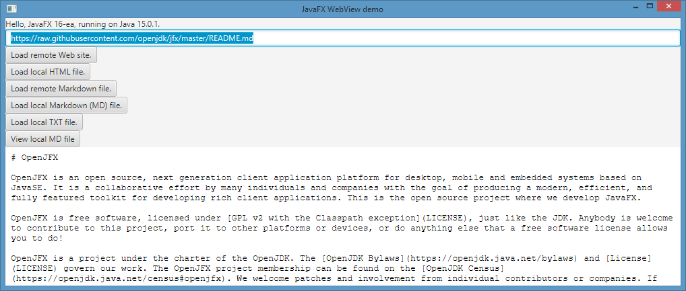

# JavaFX 16-ea+6 - possible bug in WebView

## Expected behavior

Chromium based web browsers render local and remote based MarkDown (MD) files as plain text, as shown in following images.

* Remotely stored markdown file: [remote markdown rendering](doc/Edge_Chromium_Remote_MarkdownFile.png)
* Markdown file stored in local file system: [locally stored MD file](doc/Edge_Chromium_Local_MarkdownFile.png)
* Generic TXT file stored in local file system: [locally stored MD file](doc/Edge_Chromium_Local_TextFile.png)

## Observed behavior

* Remote markdown in WebView: 
* Local markdown in WebView: 
* Local text file in WebView: 
* Local html file in WebView: 

